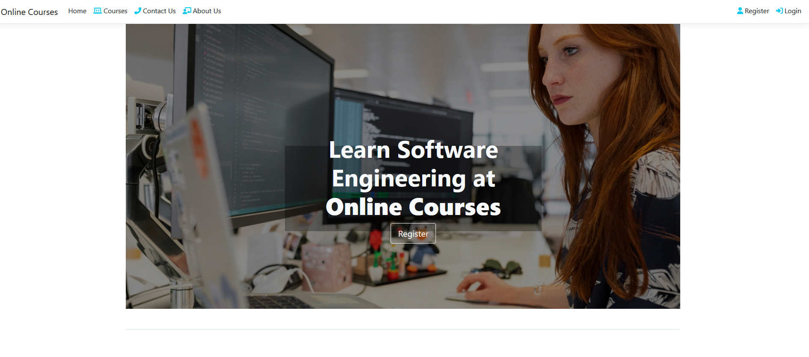
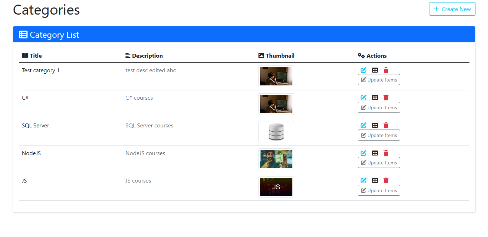
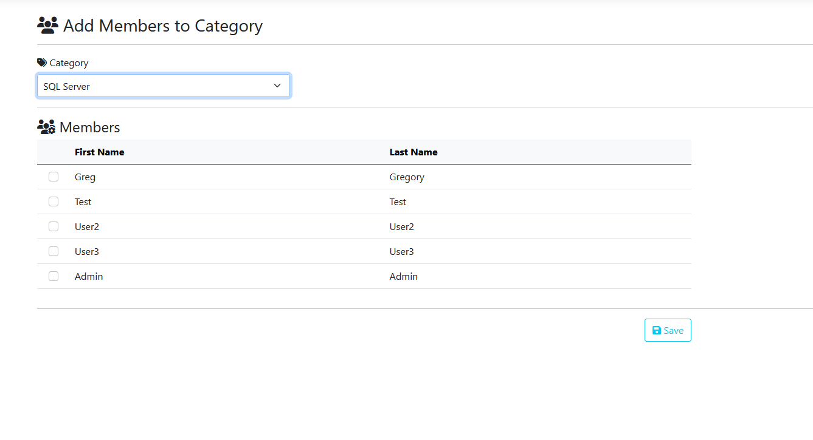
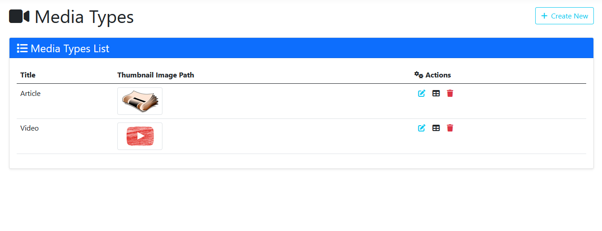
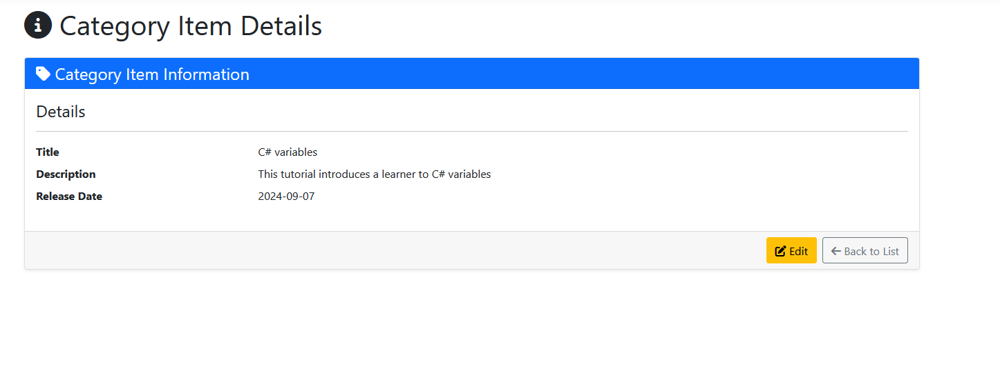

# Online Courses Application



## Table of Contents

1. [Overview](#overview)
2. [Features](#features)
3. [Screenshots](#screenshots)
4. [Installation](#installation)
5. [Usage](#usage)
6. [Technologies Used](#technologies-used)
7. [Contributing](#contributing)
8. [License](#license)

---

## Overview

The **Online Courses Application** is designed to manage online educational content, including course categories, items, and multimedia types. It features functionality for CRUD operations across multiple entities and allows administrators to manage users, categories, media types, and associated content easily. 

The application is built with a clean and intuitive UI, ensuring efficient navigation and interaction for users, administrators, and content creators.

---

## Features

- **Category Management**: Create, edit, and delete course categories.
- **Course Items**: Manage course items within categories, including media types and release dates.
- **Media Content**: Upload, edit, and manage various media types (e.g., videos, images).
- **User Management**: Assign and manage users within specific categories.
- **Fully Responsive**: Optimized for desktop and mobile devices.

---

## Screenshots

### Dashboard


### Assign user to category


### Media Management


### Course details


---

## Installation

### Prerequisites

Ensure that you have the following installed:

- .NET 6.0 or above
- MS SQL Server
- Visual Studio 2022+ (for development)

### Step-by-Step Guide

1. **Clone the repository**:
    ```bash
    git clone https://github.com/KlonicaRadoslaw/online-courses.git
    ```

2. **Database Setup**:
   - Update the connection string in `appsettings.json` to point to your SQL Server database.
   - Run database migrations (if available) to create the necessary tables:
     ```bash
     dotnet ef database update
     ```

3. **Build the Project**:
    Open the solution in Visual Studio and build the project:
    ```bash
    dotnet build
    ```

4. **Run the Application**:
    Run the application using Visual Studio or the .NET CLI:
    ```bash
    dotnet run
    ```

---

## Usage

### Running the Application

Once the application is up and running, you can access it by navigating to `http://localhost:7047` in your web browser.

1. **Navigating the Dashboard**:
   - From the dashboard, you can view the list of course categories, items, and media types.
   - Use the "Create New" button to add new categories or content.

2. **Managing Courses and Content**:
   - To add new course items or media content, navigate to the appropriate section, click the "Create" button, and fill in the required details.

3. **Assigning Users**:
   - Use the "Add Members to Category" section to assign users to specific course categories.

### Admin Features

Admins have additional permissions, such as deleting categories or items and managing users directly from the dashboard.

---

## Technologies Used

- **Backend**: ASP.NET Core 6.0, Entity Framework Core
- **Frontend**: Razor Pages, Bootstrap 5, Font Awesome Icons
- **Database**: MS SQL Server
- **JavaScript**: jQuery for handling user interaction
- **Version Control**: Git

---

## Contributing

If you'd like to contribute to this project, please follow the steps below:

1. Fork the repository
2. Create a new branch (`git checkout -b feature/your-feature`)
3. Make your changes and commit (`git commit -am 'Add new feature'`)
4. Push to the branch (`git push origin feature/your-feature`)
5. Open a pull request

---

## License

This project is licensed under the MIT License - see the [LICENSE](LICENSE) file for details.

---

Feel free to reach out to the project maintainer for any questions or support requests.

